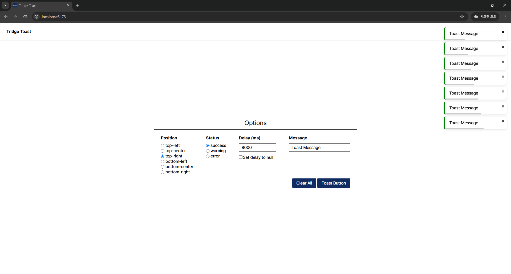

# Tridge Toast

## 실행 방법

```bash
# 1. 패키지 설치
yarn

# 2. 개발 서버 실행
yarn dev
```

## 기술 스택

- React
- scss

## Toast API

`showToastMessage(message, options?)`

```ts
export interface ToastOptions {
  status?: ToastStatus; // 'success' | 'error' | 'info'
  position?: ToastPosition; // 'top-right' | 'bottom-center' 등
  delay?: number | null; // 자동 닫힘 시간 (ms), null이면 자동 닫힘 없음
}

export type ShowToastMessage = (
  message: string,
  options?: ToastOptions
) => void;
```

### 사용 예시

```tsx
const { showToastMessage, clearAll } = useToast();

<>
  <button type="button" onClick={clearAll}>
    Clear All
  </button>

  <button
    type="button"
    onClick={() =>
      showToastMessage("Hello, world!", {
        status: "success",
        position: "top-right",
        delay: 3000,
      })
    }
  >
    Toast Button
  </button>
</>;
```


